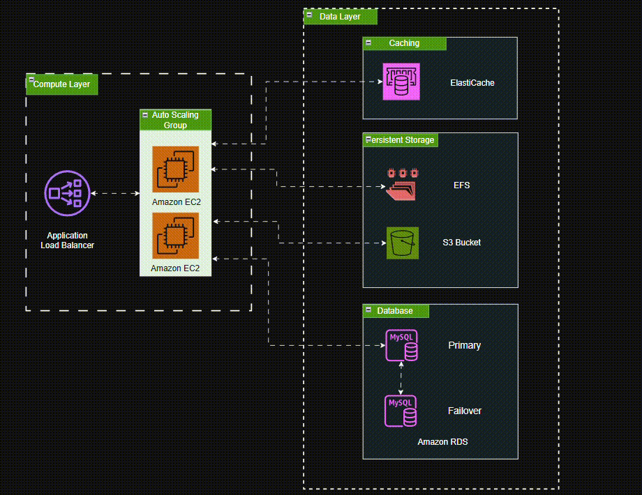

# 🏗️ WordPress High Availability Architecture (AWS)

## 📖 Overview

This architecture diagram represents a **highly available and scalable WordPress deployment on Amazon Web Services (AWS)**.  
It is designed to ensure **performance, fault tolerance, and data durability** while maintaining separation of concerns across different infrastructure layers.

The setup leverages **AWS managed services** and **auto-scaling compute resources** to handle varying workloads and traffic spikes efficiently.

---

## 🎯 Goal and Purpose

The main goal of this architecture is to provide a **resilient, fault-tolerant, and horizontally scalable environment** for hosting WordPress.  
It addresses common issues with traditional single-server setups such as:
- Downtime during traffic surges  
- Data loss due to server failure  
- Slow performance due to lack of caching or centralized storage  

By implementing this design, WordPress can scale dynamically and maintain high uptime even under heavy load.

---

## 🧩 Architecture Breakdown

### **1. Compute Layer**
This layer handles the execution of application code (WordPress PHP files).

- **Amazon EC2 (Auto Scaling Group)**  
  Hosts the WordPress application. EC2 instances automatically scale in or out depending on demand.  
  Each instance retrieves shared assets and media from a central storage location.

- **Application Load Balancer (ALB)**  
  Distributes incoming traffic evenly across all EC2 instances in the Auto Scaling Group.  
  Ensures no single instance becomes a bottleneck and provides health checks for availability.

---

### **2. Data Layer**
The data layer handles caching, persistent storage, and database management.

#### 🧠 Caching
- **Amazon ElastiCache (Redis or Memcached)**  
  Improves WordPress performance by caching frequently accessed queries and pages.  
  Reduces load on the database and speeds up response times.

#### 💾 Persistent Storage
- **Amazon EFS (Elastic File System)**  
  Shared storage for WordPress files (e.g., themes, plugins, uploads).  
  Ensures all EC2 instances access the same file system, maintaining consistency.

- **Amazon S3 (Simple Storage Service)**  
  Used for offloading and storing static assets (images, media files, backups).  
  Highly durable and scalable object storage.

#### 🗄️ Database
- **Amazon RDS (MySQL)**  
  Managed relational database service for WordPress data.  
  Includes:
  - **Primary instance** for write operations  
  - **Failover instance** for high availability and automatic recovery  

---

## ⚙️ Key Features

- ✅ **High Availability:** Redundant components across multiple Availability Zones  
- ⚡ **Scalability:** Auto Scaling and Load Balancing handle fluctuating workloads  
- 🧩 **Separation of Concerns:** Independent compute, storage, and database layers  
- 🔒 **Resilience & Data Protection:** Multi-AZ RDS deployment and centralized file storage  
- 🚀 **Performance Optimization:** In-memory caching with ElastiCache  

---

## 🧠 Ideal Use Cases

- Production-grade WordPress websites  
- E-commerce or news platforms with variable traffic  
- Multi-instance WordPress hosting environments  
- Migration from single-server WordPress to AWS infrastructure  

---

## 🧰 AWS Services Used

| Category | AWS Service | Purpose |
|-----------|--------------|----------|
| **Compute** | EC2 + Auto Scaling Group | Runs WordPress and scales with demand |
| **Networking** | Application Load Balancer | Distributes traffic across EC2 instances |
| **Storage** | EFS, S3 | Shared and durable storage for files |
| **Database** | RDS (MySQL) | Managed relational database |
| **Caching** | ElastiCache | Accelerates data access and reduces DB load |

---

## 🏁 Summary

This architecture provides a **modular, scalable, and reliable** solution for hosting WordPress on AWS.  
By decoupling application, storage, and data layers, it achieves:
- Minimal downtime  
- Optimized performance  
- Simplified maintenance  

It is an ideal foundation for teams aiming to host WordPress in a **cloud-native, enterprise-grade environment**.

---

## 📜 License

This project is licensed under the [MIT License](./LICENSE).

---

## 👨‍💻 Author

**Ian Tumulak**  
[https://iantumulak-website.vercel.app](https://iantumulak-website.vercel.app)
